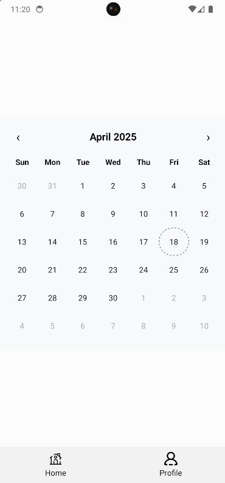
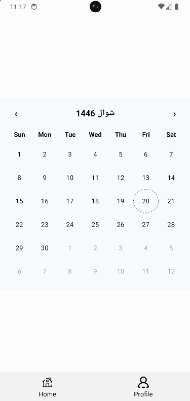
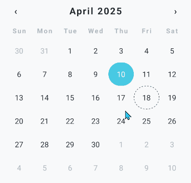

# react-native-taqweem

**A dual calendar component (Hijri + Gregorian) for React Native** — minimal and customizable.  
Perfect for apps needing culturally-aware calendars, Islamic date pickers, or just modern UX flexibility.

## 🕌 What is “Taqweem”?
The word Taqweem (تقويم) is Arabic for “calendar” or “system of timekeeping.”
It refers to how dates are calculated and organized — whether by the moon (Hijri) or the sun (Gregorian).
The name reflects the component's purpose: a culturally-aware dual calendar for modern apps.

## ✅ **Features**

### 📆 Calendar Modes

- ✅ Supports both **Hijri** and **Gregorian** calendars
- ✅ Swappable via `calendarMode` prop (`'hijri' | 'gregorian'`)

---

### 🗓 Date Display & Navigation

- ✅ Displays correct **day grid for the month**
- ✅ Handles **adjacent days** (padding from prev/next months)
    
    • Controlled by `showAdjacentMonths` prop
    
- ✅ Month & year **header** with centered title
- ✅ `<` and `>` arrows to navigate months
- ✅ Arrows auto-hide when min/max bounds are reached
- ✅ Supports custom header via `renderHeader` prop

---

### 📍 Selection Logic

- ✅ Allows selecting a single day
- ✅ Toggles selection on repeat tap
- ✅ Disables selection of future dates via `allowFutureDates` prop
- ✅ Blocks navigation into future if `allowFutureDates === false`

---

### 🔢 Date Limits

- ✅ Accepts `minDate` and `maxDate` as prop to restrict navigation & selection
- ✅ Defaults to:
• `minDate`: `'1400-1'` (Hijri) or `'1900-1'` (Gregorian)
    
    • `maxDate`: current date + 10 years
    

---

### 📤 Event Emission

- ✅ `onDateChange` prop to inform parent when a day is selected
• Provides:
    - `calendarDate`: in current `calendarMode` format
    - `gregorianDate`: always in `'YYYY-MM-DD'`
    - `hijriDate`: always in `'iYYYY-iM-iD'`
    - `momentObj`: full Moment object


## Installation

Install **react-native-taqweem** with npm

```bash
  npm install react-native-taqweem
```
    
## Usage/Examples

```typescript
import React from 'react';
import {StyleSheet, View} from 'react-native';
import {Screen} from '@src/components';
import {DualCalendar} from 'react-native-taqweem';

const Home = () => {
  return (
    <Screen>
      <View style={styles.main}>
    //   Default calendar mode is gregorian
        <DualCalendar />
      </View>
    </Screen>
  );
};

export default Home;
```

You can make the `calendarMode` as hijri to render Hijri calendar. 

```typescript

<DualCalendar calendarMode="hijri" />


```

You can configure the theme using `calendarTheme` prop.

```typescript

import {CalendarTheme, DualCalendar} from 'react-native-taqweem';
import {useTheme} from '@src/context/theme-context';

const getCalendarThemeStyles = (theme: 'light' | 'dark') =>
  StyleSheet.create<CalendarTheme>({
    calendarView: {
      backgroundColor: theme === 'light' ? '#f8f9fa' : '#212529',
      borderRadius: 16,
    },
	...
	// more configurable properties

const Home = () => {
  const {theme, toggleTheme} = useTheme();
  const calendarTheme = getCalendarThemeStyles(theme);
  return (
    <Screen>
      <Button title="Toggle Theme" onPress={toggleTheme} />
      <View style={styles.main}>
        <DualCalendar calendarTheme={calendarTheme} />
      </View>
    </Screen>
  );
};

```


## Screenshots

### Gregorian Calendar



### Hijri Calendar



### Configurable Theme and Look




## Acknowledgements

> Built with ❤️ using `moment-hijri` under the hood, supports localization, RTL, theming, and full date control.


## Authors

- [@jawadvajeeh](https://www.github.com/jawadvajeeh)


## Contributing


Thank you for your interest in contributing to **react-native-taqweem**! 🙌

If you’d like to suggest a feature, report a bug, or collaborate in any way —  
please feel free to get in touch:

📩 **jawadvajeeh@gmail.com**

Looking forward to hearing from you!


